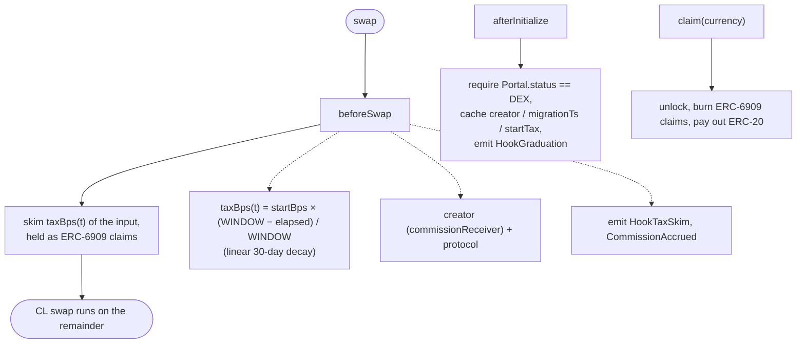

<div align="center">

# ⚡ FlapVenue

### Flap reserved a Uniswap V4 graduation path but never shipped it. FlapVenue is a working one.

A **Uniswap V4 hook** on **OKX X Layer** that turns Flap's creator tax into a decaying `beforeSwap` delta. That delta lets a Flap tax token hold concentrated liquidity, which its current graduation path can't.

[](https://web3.okx.com/xlayer/build-x-hackathon/hook)
[](https://docs.uniswap.org/contracts/v4/overview)
[](https://www.okx.com/xlayer)
[](./LICENSE)

**English** · [中文](./README.zh.md)

[**🚀 Live demo**](https://web-beautifulremis-projects.vercel.app) · [**📜 Contracts**](#-live-on-x-layer-testnet-chain-1952) · [**🏆 Hackathon**](https://web3.okx.com/xlayer/build-x-hackathon/hook) · [**🧩 How it works**](#️-how-the-hook-works)

</div>

---

## 🎯 The gap

Flap's launch contracts **reserve** a Uniswap V4 graduation path: the enum `MigratorType.V4_UNI_MIGRATOR`, commented `// (Base, XLayer)`, and the latest Portal even wires up `uniV4Migrator` / `v4CLHook` slots. **But it isn't live.** Public launches still graduate only through `PCS_INFINITY_CL_MIGRATOR`; any other migrator reverts with `InvalidMigratorType()`. The docs also restrict a **tax token to "Uniswap V2 or its forks"**, so today a Flap tax token has **nowhere to hold concentrated liquidity**.

**FlapVenue implements that missing V4 destination.** It reproduces Flap's creator tax as a `beforeSwap` **hook delta** (not an ERC-20 transfer tax) that **decays linearly from 10% to 0% over 30 days**, gated to tokens the Flap Portal reports as graduated (`status == DEX`). Because the tax is a hook delta rather than a transfer tax, a Flap tax token can hold concentrated liquidity. Its live graduation path can't.

> Built for the OKX X Layer "Build X" hackathon, "Hook the Future" track. Uniswap × Flap × X Layer.

---

## 🚀 Live on X Layer testnet (chain 1952)

> **[▶ Open the live demo →](https://web-beautifulremis-projects.vercel.app)**  ·  EN / 中文 toggle in the header.
> _The trading terminal (candles / orderbook / PnL) runs on a **simulated feed**; the **real on-chain** numbers (decay, skims, commission, graduations) are in the dashboard below it._

| Contract | Address (OKLink) |
|---|---|
| **FlapVenue hook** | [`0x5f07e9CA…4b1c9088`](https://www.oklink.com/x-layer-testnet/address/0x5f07e9CA7c006528bB21d098230F25364b1c9088) |
| PoolManager (own deploy) | [`0xd4438703…d4e7Eb04`](https://www.oklink.com/x-layer-testnet/address/0xd44387034102491Af58292fF1c7405AED4e7Eb04) |
| FLAP (graduated tax token, no transfer tax) | [`0x91Eb5b51…675bE1556`](https://www.oklink.com/x-layer-testnet/address/0x91Eb5b51715AB2958d3087992176616675bE1556) |
| USDT0 (quote, mock) | [`0xBEd71c18…74f05Ef3c`](https://www.oklink.com/x-layer-testnet/address/0xBEd71c18e2275F0A10c56c8f22EbFE774f05Ef3c) |

The hook address ends in `…9088`; its low bits encode the permission flags `afterInitialize | beforeSwap | beforeSwapReturnDelta` (mined with `HookMiner`). The deploy also confirms EIP-1153 transient storage works on X Layer testnet, since the PoolManager and real swaps executed.

---

## ⚙️ How the hook works



| On-chain event | Emitted by | Meaning |
|---|---|---|
| `HookGraduation` | `_afterInitialize` | a graduated Flap token's pool is gated in |
| `HookTaxSkim` | `_beforeSwap` | decaying creator tax skimmed from a swap |
| `CommissionAccrued` | `_beforeSwap` | creator / protocol split booked |
| `Claimed` | `claim` / `unlockCallback` | accrued tax redeemed to ERC-20 |

Every state change emits a self-describing event. The 10%→0% decay curve and the full skim and commission flow can be read straight from the logs.

---

## ▶️ Quickstart

```bash
git clone --recurse-submodules https://github.com/beautifulrem/flapvenue
cd flapvenue

# Contracts (Foundry)
cd contracts
forge build
forge script script/DeployTestnet.s.sol \
  --rpc-url https://testrpc.xlayer.tech/terigon --broadcast    # needs PRIVATE_KEY in contracts/.env

# Frontend (Next.js)
cd ../web
npm install
npm run dev                                  # http://localhost:3000  (mock data)
NEXT_PUBLIC_DATA_SOURCE=live npm run dev     # reads the live testnet hook
```

---

## 🗂 Repo layout

```
contracts/   Foundry · Uniswap v4-template + OZ uniswap-hooks (deps as submodules)
  src/FlapVenue.sol            the hook
  src/interfaces/              IFlapPortal · IFlapTaxTokenV3
  test/                        contract tests + mocks
  script/DeployTestnet.s.sol   full X Layer testnet deploy (own PoolManager + routers)
web/         Next.js 16 · wagmi/viem · Tailwind · lightweight-charts · Recharts
  src/lib/{data,i18n,feed}     mock ↔ live data layer · EN/中文 · synthetic price feed
  src/components/              TradeTerminal · PriceChart · OrderBook · Dashboard · …
```

---

## 🔧 What it does

- Implements the exact `V4_UNI_MIGRATOR` destination Flap defines in its enum and Portal slots but hasn't activated.
- No live Uniswap V4 Flap graduation venue exists today. Modelling the tax as a hook delta is what lets a Flap tax token hold concentrated liquidity.
- Each swap emits a `HookTaxSkim`. The 10%→0% decay curve reads straight from the logs.
- Accrual is gated to Flap's real `status == DEX` and `commissionReceiver`, so it can't be repointed at an unrelated token.
- An OKX-style dark terminal: live candles, a depth order book, PnL, EN/中文.

---

<details>
<summary><b>📚 Background and sources</b></summary>

Flap's `MigratorType` enum:

```solidity
enum MigratorType {
    V3_MIGRATOR,             // Uniswap V3-like pool
    V2_MIGRATOR,             // Uniswap V2-like pool
    V4_UNI_MIGRATOR,         // Uniswap V4 pool (commented "Base, XLayer")
    PCS_INFINITY_CL_MIGRATOR // PancakeSwap Infinity CL (BNB)
}
```

Checked against Flap's docs and the on-chain Portal (May 2026):
- `V4_UNI_MIGRATOR` **exists**, commented for **Base / X Layer**, and the latest Portal wires `uniV4Migrator` / `v4CLHook` slots. It's reserved, not hypothetical.
- **Not live:** public launches graduate only via `PCS_INFINITY_CL_MIGRATOR`; other migrators **revert `InvalidMigratorType()`**. Tax tokens are docs-restricted to "Uniswap V2 or its forks".
- **No live Flap → Uniswap V4 graduation venue** exists on Base or X Layer.

Sources: [token launch through Portal](https://docs.flap.sh/flap/developers/token-launcher-developers/launch-token-through-portal) · [list on DEX](https://docs.flap.sh/flap/developers/basic-and-mechanism/list-on-dex) · [inspect a token](https://docs.flap.sh/flap/developers/wallet-and-terminal-and-bot-developers/inspect-a-token) · [Flap Portal on X Layer (OKLink)](https://www.oklink.com/xlayer/address/0xb30D8c4216E1f21F27444D2FfAee3ad577808678).

> The "reserved but not live" status rests on two things: the documented enum, and the runtime `InvalidMigratorType()` revert. It doesn't depend on claims about specific unimplemented internal functions, since Flap's contracts are partly closed-source.

**What FlapVenue is, and what it isn't:** a standalone, working V4 hook and pool that reproduces the *economics* of that V4 destination. It is **not** wired into Flap's Portal as its `uniV4Migrator`; adopting it for real graduation routing would be Flap's call, or a fork's. Treat it as a reference implementation, not an in-place completion of Flap's closed contracts. The testnet deploy uses a mock Portal, since Flap isn't on X Layer testnet, and the hook validates against the real Flap Portal interface (`getTokenV5`/`getTokenV7`, `status == DEX`).

</details>

---

<div align="center">
<sub>Uniswap V4 × Flap × X Layer · MIT licensed · the V4_UNI_MIGRATOR path Flap reserved but never shipped.</sub>
</div>
