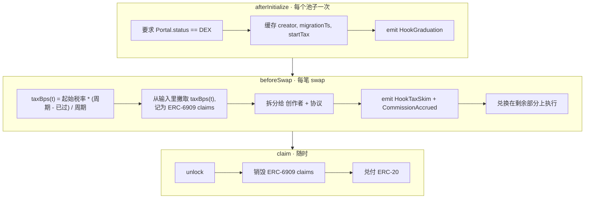

<div align="center">

# ⚡ FlapVenue

### Flap 在合约里预留了 Uniswap V4 毕业路径，却一直没上线。FlapVenue 是一个能跑的实现。

一个跑在 **OKX X Layer** 上的 **Uniswap V4 Hook**：把 Flap 的创作者税做成会衰减的 `beforeSwap` delta。这个 delta 让 Flap 税代币能进集中流动性池，而它现有的毕业路径做不到。

[](https://web3.okx.com/xlayer/build-x-hackathon/hook)
[](https://docs.uniswap.org/contracts/v4/overview)
[](https://www.okx.com/zh-hans/xlayer)
[](./LICENSE)

[English](./README.md) · **中文**

[**🎬 演示视频**](https://youtu.be/lr0lQpsHzBk) · [**🚀 在线演示**](https://web-beautifulremis-projects.vercel.app) · [**📜 合约**](#-已上线-x-layer-测试网链-1952) · [**🏆 黑客松**](https://web3.okx.com/xlayer/build-x-hackathon/hook) · [**🧩 原理**](#️-hook-如何工作)

<a href="https://youtu.be/lr0lQpsHzBk"></a>

▶ **[在 YouTube 观看 2 分钟演示](https://youtu.be/lr0lQpsHzBk)**

</div>

---

## 🎯 切入点

Flap 的发币合约**预留**了一条 Uniswap V4 毕业路径：枚举 `MigratorType.V4_UNI_MIGRATOR`，注释写着 `// (Base, XLayer)`，最新的 Portal 甚至接好了 `uniV4Migrator` / `v4CLHook` 槽位。**但它还没上线**。公开发币目前只能走 `PCS_INFINITY_CL_MIGRATOR` 毕业，传其他任何 migrator 都会 `revert InvalidMigratorType()`。Flap 文档还把**税代币限制在"Uniswap V2 或其分叉"**，所以今天 Flap 税代币没有能放集中流动性的地方。

**FlapVenue 实现了这条缺失的 V4 路径。** 它把 Flap 的创作者税做成一个 `beforeSwap` 的 **hook delta**（不是 ERC-20 转账税），在 **30 天内从 10% 线性衰减到 0%**，且只对 Flap Portal 报告为已毕业（`status == DEX`）的代币生效。因为税是 hook delta 而不是转账税，Flap 税代币可以待在集中流动性池里。它现有的毕业路径做不到这点。

> 为 OKX X Layer「Build X」黑客松的「Hook the Future」赛道而建。Uniswap × Flap × X Layer。

---

## 🚀 已上线 X Layer 测试网（链 1952）

> **[▶ 打开在线演示 →](https://web-beautifulremis-projects.vercel.app)**  ·  页头可切换 EN / 中文。
> _交易终端（K线 / 订单簿 / 盈亏）使用**模拟数据**；**真实链上**数字（衰减、撇税、佣金、毕业事件）在其下方的数据面板里。_

**试一笔真实兑换（约一分钟）：**
1. [打开演示](https://web-beautifulremis-projects.vercel.app)，先去 [X Layer 水龙头](https://www.okx.com/xlayer/faucet) 领测试网 OKB。新钱包需要 gas，这是唯一要手动做的一步。
2. 连接钱包，按提示添加 / 切换到 X Layer 测试网（链 1952）。
3. 在「兑换」面板点按钮走流程：自动 mint 测试代币 → 授权路由 → 兑换（各签一次名）。
4. 点「加入钱包」即可在钱包里看到 FLAP / USDT0 余额。这笔兑换约 15 秒后会出现在上方的「撇税流水」和「累计佣金」面板。

| 合约 | 地址（OKLink） |
|---|---|
| **FlapVenue hook** | [`0x5f07e9CA…4b1c9088`](https://www.oklink.com/x-layer-testnet/address/0x5f07e9CA7c006528bB21d098230F25364b1c9088) |
| PoolManager（自部署） | [`0xd4438703…d4e7Eb04`](https://www.oklink.com/x-layer-testnet/address/0xd44387034102491Af58292fF1c7405AED4e7Eb04) |
| PoolSwapTest（兑换路由） | [`0xB59271CD…E2fa7AF6`](https://www.oklink.com/x-layer-testnet/address/0xB59271CD9158Bb50125c3F9AC5CA013eE2fa7AF6) |
| FLAP（已毕业税代币，无转账税） | [`0x91Eb5b51…675bE1556`](https://www.oklink.com/x-layer-testnet/address/0x91Eb5b51715AB2958d3087992176616675bE1556) |
| USDT0（计价币，mock） | [`0xBEd71c18…74f05Ef3c`](https://www.oklink.com/x-layer-testnet/address/0xBEd71c18e2275F0A10c56c8f22EbFE774f05Ef3c) |

以上每个合约的**源码均已在 OKLink 验证**（点开地址、切到 Contract 标签即可查看源码）。

Hook 地址以 `…9088` 结尾，低位编码了权限标志 `afterInitialize | beforeSwap | beforeSwapReturnDelta`（用 `HookMiner` 挖出）。这次部署也说明 X Layer 测试网支持 EIP-1153 瞬态存储，因为 PoolManager 和真实 swap 都成功执行了。

---

## ⚙️ Hook 如何工作



| 链上事件 | 触发于 | 含义 |
|---|---|---|
| `HookGraduation` | `_afterInitialize` | 一个已毕业 Flap 代币的池子被纳入 |
| `HookTaxSkim` | `_beforeSwap` | 从一笔 swap 撇取衰减中的创作者税 |
| `CommissionAccrued` | `_beforeSwap` | 创作者 / 协议分成入账 |
| `Claimed` | `claim` / `unlockCallback` | 累计税兑付为 ERC-20 |

每一次状态变化都会发出一个自描述事件。整条 10%→0% 衰减曲线和完整的撇税 / 佣金流都能直接从链上日志读出来。

---

## ▶️ 快速开始

```bash
git clone --recurse-submodules https://github.com/beautifulrem/flapvenue
cd flapvenue

# 合约(Foundry)
cd contracts
forge build
forge script script/DeployTestnet.s.sol \
  --rpc-url https://testrpc.xlayer.tech/terigon --broadcast    # 需在 contracts/.env 配 PRIVATE_KEY

# 前端(Next.js)
cd ../web
npm install
npm run dev                                  # http://localhost:3000  (mock 数据)
NEXT_PUBLIC_DATA_SOURCE=live npm run dev     # 读取线上测试网 hook
```

---

## 🗂 仓库结构

```
contracts/   Foundry · Uniswap v4-template + OZ uniswap-hooks(依赖为子模块)
  src/FlapVenue.sol            主 hook
  src/interfaces/              IFlapPortal · IFlapTaxTokenV3
  test/                        合约测试 + mocks
  script/DeployTestnet.s.sol   X Layer 测试网完整部署(自部署 PoolManager + 路由)
web/         Next.js 16 · wagmi/viem · Tailwind · lightweight-charts · Recharts
  src/lib/{data,i18n,feed}     mock ↔ live 数据层 · EN/中文 · 模拟价格源
  src/components/              TradeTerminal · PriceChart · OrderBook · Dashboard · …
```

---

## 🔧 它做了什么

- 实现了 Flap 在枚举和 Portal 槽位里定义、但一直没启用的那条 `V4_UNI_MIGRATOR` 路径。
- 目前没有在运行的 Uniswap V4 Flap 毕业场所。把税做成 hook delta，正是让 Flap 税代币能进集中流动性的关键。
- 每笔 swap 发出一条 `HookTaxSkim`，10%→0% 的衰减曲线可以直接从日志读出。
- accrual 只认 Flap 真实的 `status == DEX` 和 `commissionReceiver`，没法被随便 fork 到别的代币上。
- OKX 风格的深色终端：实时 K线、深度订单簿、盈亏曲线，中英双语。

---

<details>
<summary><b>📚 背景与来源</b></summary>

Flap 的 `MigratorType` 枚举：

```solidity
enum MigratorType {
    V3_MIGRATOR,             // Uniswap V3 类池
    V2_MIGRATOR,             // Uniswap V2 类池
    V4_UNI_MIGRATOR,         // Uniswap V4 池（注释 "Base, XLayer"）
    PCS_INFINITY_CL_MIGRATOR // PancakeSwap Infinity CL (BNB)
}
```

对照 Flap 文档和链上 Portal（2026 年 5 月）：
- `V4_UNI_MIGRATOR` **存在**，注释指向 **Base / X Layer**，最新 Portal 也接好了 `uniV4Migrator` / `v4CLHook` 槽位。是预留好的，不是猜的。
- **未上线**：公开发币只走 `PCS_INFINITY_CL_MIGRATOR`；其他 migrator **`revert InvalidMigratorType()`**。税代币被文档限制为"Uniswap V2 或其分叉"。
- Base / X Layer 上**没有任何在运行的 Flap → Uniswap V4 毕业场所**。

来源：[通过 Portal 发币](https://docs.flap.sh/flap/developers/token-launcher-developers/launch-token-through-portal) · [上 DEX](https://docs.flap.sh/flap/developers/basic-and-mechanism/list-on-dex) · [查询代币](https://docs.flap.sh/flap/developers/wallet-and-terminal-and-bot-developers/inspect-a-token) · [Flap Portal @ X Layer (OKLink)](https://www.oklink.com/xlayer/address/0xb30D8c4216E1f21F27444D2FfAee3ad577808678)。

> "预留但未上线"这个判断来自两点：文档里的枚举，以及运行时的 `InvalidMigratorType()` revert。它不依赖于对某个未实现函数名的断言，因为 Flap 合约部分闭源。

**FlapVenue 是什么、不是什么：** 一个独立、可运行的 V4 hook + 池，复刻那条 V4 路径的*经济模型*。它**没有**作为 `uniV4Migrator` 接进 Flap 的 Portal；要真正用于毕业路由，需要 Flap（或某个 fork）采纳。把它当作该路径的一个参考实现，而不是在 Flap 闭源合约里就地补完。测试网用的是 mock Portal（Flap 未部署在 X Layer 测试网），hook 对照真实 Flap Portal 接口校验（`getTokenV5`/`getTokenV7`、`status == DEX`）。

</details>

---

<div align="center">
<sub>Uniswap V4 × Flap × X Layer · MIT 许可 · Flap 预留却没上线的 V4_UNI_MIGRATOR 路径。</sub>
</div>
